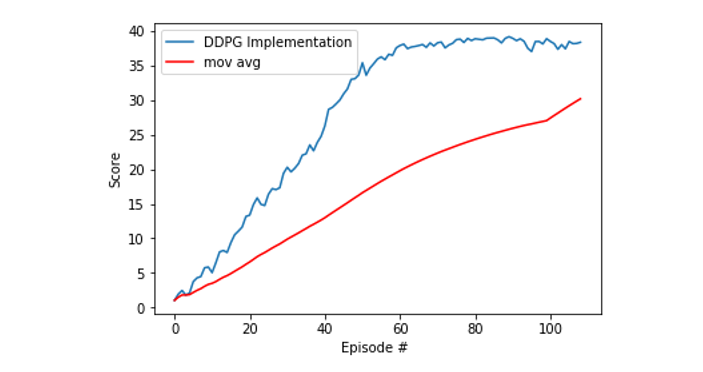

# DRL-ProjectTwo-Continuous-Control
Udacity Nanodegree on DRL - Project 2

# Getting Started with the code
The Environment has been provided already by Udacity in its workspace. In case you want to download in follow the instructions below and unzip the environment in the main folder of this repo.

### Download the Unity Environment
For this project, you will not need to install Unity - this is because we have already built the environment for you, and you can download it from one of the links below. You need only select the environment that matches your operating system:

Version 1: One (1) Agent

    Linux: https://s3-us-west-1.amazonaws.com/udacity-drlnd/P2/Reacher/one_agent/Reacher_Linux.zip
    Mac OSX: https://s3-us-west-1.amazonaws.com/udacity-drlnd/P2/Reacher/one_agent/Reacher.app.zip
    Windows (32-bit): https://s3-us-west-1.amazonaws.com/udacity-drlnd/P2/Reacher/one_agent/Reacher_Windows_x86.zip
    Windows (64-bit): https://s3-us-west-1.amazonaws.com/udacity-drlnd/P2/Reacher/one_agent/Reacher_Windows_x86_64.zip

Version 2: Twenty (20) Agents

    Linux: https://s3-us-west-1.amazonaws.com/udacity-drlnd/P2/Reacher/Reacher_Linux.zip
    Mac OSX: https://s3-us-west-1.amazonaws.com/udacity-drlnd/P2/Reacher/Reacher.app.zip
    Windows (32-bit): https://s3-us-west-1.amazonaws.com/udacity-drlnd/P2/Reacher/Reacher_Windows_x86.zip
    Windows (64-bit): https://s3-us-west-1.amazonaws.com/udacity-drlnd/P2/Reacher/Reacher_Windows_x86_64.zip


Then, place the file in the pDRL-ProjectTwo-Continuous-Control/, and unzip (or decompress) the file.

(For Windows users) Check out this link if you need help with determining if your computer is running a 32-bit version or 64-bit version of the Windows operating system.

(For AWS) If you'd like to train the agent on AWS (and have not enabled a virtual screen), then please use this link (version 1) or this link (version 2) to obtain the "headless" version of the environment. You will not be able to watch the agent without enabling a virtual screen, but you will be able to train the agent. (To watch the agent, you should follow the instructions to enable a virtual screen, and then download the environment for the Linux operating system above.)


# Goal of the Project

In this project is asked to train a double-joined arm agent able to tackle a target the Unity's Reacher environment. As instructed a reward of +0.1 is provided for each step that the agent's hand is in the goal location. Thus, the goal of your agent is to maintain its position at the target location for as many time steps as possible.
The observation space consists of 33 variables corresponding to the position, rotation, velocity, and angular velocities of the arm. Each action is a vector with four numbers, corresponding to torque applicable to two joints. Every entry in the action vector should be a number between -1 and 1.
 
# Learning Algorithm
### Deep Deterministic Policy Gradient (DDPG)
Considering the goal of the project and the environment provided, the Agent will be trained using a DDPG algorithm which tackles exactly the needs of this problem of continuous control as stated in this paper

The implementation of the algorithm is based on the template provided by Udacity at https://github.com/udacity/deep-reinforcement-learning/tree/master/ddpg-pendulum. A key factor of the implementation is the usage of an Actor-Critic Agent which enhances the estimation of an optimal policy by maximizing separately cumulative state-action values applying a gradient ascent approach (with Gradient Clipping added to avoid the exponential growth of gradients)
In this project, the actor-critic agent has been implemented in the DDPG_Agent.py file, while the actor-critic models are in the model.py file.

As stated in the DDPG paper stated above, to balance continuous space exploitation, the Agent has been provided with a Ornstein-Uhlenbeck process which is responsible for adding noise according to the provided parameters: 

```python
OU_SIGMA = 0.2          # Ornstein-Uhlenbeck noise parameter
OU_THETA = 0.15         # Ornstein-Uhlenbeck noise parameter
EPSILON = 1.0           # explore->exploit noise process added to act step
EPSILON_DECAY = 1e-6    # decay rate for noise process
```

###Learning Steps
The learning of the Agents have been split according to the parameters below

```python
LEARN_EVERY = 25        #learning timesteps
LEARN_NUM = 10          # learning passes
```

### Agent Learning Model
Parameters
```python
BUFFER_SIZE = int(1e6)  # replay buffer size
BATCH_SIZE = 128        # minibatch size
GAMMA = 0.99            # discount factor
TAU = 1e-3              # for soft update of target parameters
LR_ACTOR = 1e-3         # learning rate of the actor
LR_CRITIC = 1e-3        # learning rate of the critic
WEIGHT_DECAY = 0        # L2 weight decay
LEARN_EVERY = 20        # learning timestep interval
LEARN_NUM = 10          # number of learning passes
OU_SIGMA = 0.2          # Ornstein-Uhlenbeck noise parameter
OU_THETA = 0.15         # Ornstein-Uhlenbeck noise parameter
EPSILON = 1.0           # explore->exploit noise process added to act step
EPSILON_DECAY = 1e-6    # decay rate for noise process
```

The Agent will be trainend according to the Actor-Critic models defined as follow:

### Actor Learning Model
```python
class Actor(nn.Module):
    """Actor (Policy) Model."""

    def __init__(self, state_size, action_size, seed, fc1_units=400, fc2_units=300):
        """Initialize parameters and build model.
        Params
        ======
            state_size (int): Dimension of each state
            action_size (int): Dimension of each action
            seed (int): Random seed
            fc1_units (int): Number of nodes in first hidden layer
            fc2_units (int): Number of nodes in second hidden layer
        """
        super(Actor, self).__init__()
        self.seed = torch.manual_seed(seed)

        self.fc1 = nn.Linear(state_size, fc1_units)
        self.bn1 = nn.BatchNorm1d(fc1_units)
        self.fc2 = nn.Linear(fc1_units, fc2_units)
        self.fc3 = nn.Linear(fc2_units, action_size)
        self.reset_parameters()

    def reset_parameters(self):
        self.fc1.weight.data.uniform_(*hidden_init(self.fc1))
        self.fc2.weight.data.uniform_(*hidden_init(self.fc2))
        self.fc3.weight.data.uniform_(-3e-3, 3e-3)

    def forward(self, state):
        """Build an actor (policy) network that maps states -> actions."""
        x = F.relu(self.bn1(self.fc1(state)))
        x = F.relu(self.fc2(x))
        return F.tanh(self.fc3(x))
```

### Critic Learning Model
```python
class Critic(nn.Module):
    """Critic (Value) Model."""

    def __init__(self, state_size, action_size, seed, fcs1_units=400, fc2_units=300):
        """Initialize parameters and build model.
        Params
        ======
            state_size (int): Dimension of each state
            action_size (int): Dimension of each action
            seed (int): Random seed
            fcs1_units (int): Number of nodes in the first hidden layer
            fc2_units (int): Number of nodes in the second hidden layer
        """
        super(Critic, self).__init__()
        self.seed = torch.manual_seed(seed)

        self.fcs1 = nn.Linear(state_size, fcs1_units)
        self.bn1 = nn.BatchNorm1d(fcs1_units)
        self.fc2 = nn.Linear(fcs1_units+action_size, fc2_units)
        self.fc3 = nn.Linear(fc2_units, 1)
        self.reset_parameters()

    def reset_parameters(self):
        self.fcs1.weight.data.uniform_(*hidden_init(self.fcs1))
        self.fc2.weight.data.uniform_(*hidden_init(self.fc2))
        self.fc3.weight.data.uniform_(-3e-3, 3e-3)

    def forward(self, state, action):
        """Build a critic (value) network that maps (state, action) pairs -> Q-values."""
        xs = F.relu(self.bn1(self.fcs1(state)))
        x = torch.cat((xs, action), dim=1)
        x = F.relu(self.fc2(x))
        return self.fc3(x)
```

### Experience Replay
Experience replay allows the Agents to learn from past experiences, a buffer has been added as follows 

```python
class ReplayBuffer:
    """Fixed-size buffer to store experience tuples."""

    def __init__(self, action_size, buffer_size, batch_size, seed):
        """Initialize a ReplayBuffer object.
        Params
        ======
            buffer_size (int): maximum size of buffer
            batch_size (int): size of each training batch
        """
        self.action_size = action_size
        self.memory = deque(maxlen=buffer_size)  # internal memory (deque)
        self.batch_size = batch_size
        self.experience = namedtuple("Experience", field_names=["state", "action", "reward", "next_state", "done"])
        self.seed = random.seed(seed)

    def add(self, state, action, reward, next_state, done):
        """Add a new experience to memory."""
        e = self.experience(state, action, reward, next_state, done)
        self.memory.append(e)

    def sample(self):
        """Randomly sample a batch of experiences from memory."""
        experiences = random.sample(self.memory, k=self.batch_size)

        states = torch.from_numpy(np.vstack([e.state for e in experiences if e is not None])).float().to(device)
        actions = torch.from_numpy(np.vstack([e.action for e in experiences if e is not None])).float().to(device)
        rewards = torch.from_numpy(np.vstack([e.reward for e in experiences if e is not None])).float().to(device)
        next_states = torch.from_numpy(np.vstack([e.next_state for e in experiences if e is not None])).float().to(device)
        dones = torch.from_numpy(np.vstack([e.done for e in experiences if e is not None]).astype(np.uint8)).float().to(device)

        return (states, actions, rewards, next_states, dones)

    def __len__(self):
        """Return the current size of internal memory."""
        return len(self.memory)
 ```
 
# Results


# Future Developments
As suggested by Udacity, a good future development of this project would be using the Distributed Distributional Deterministic Policy Gradients https://openreview.net/forum?id=SyZipzbCb
